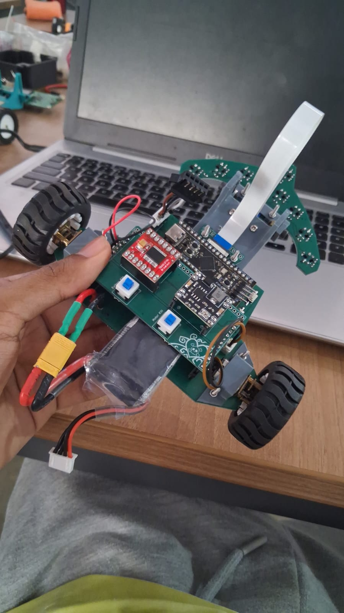
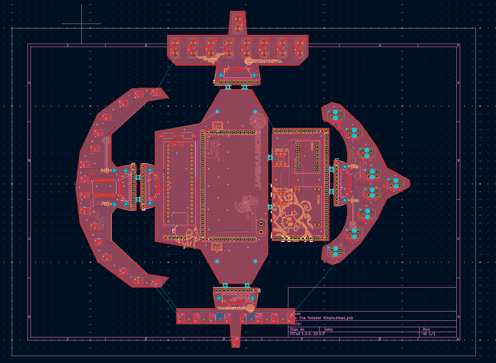
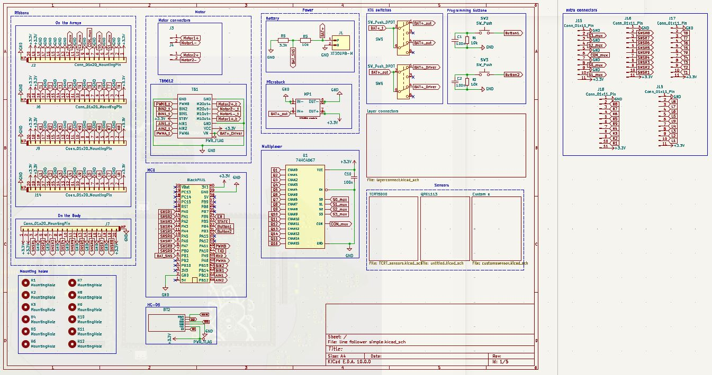
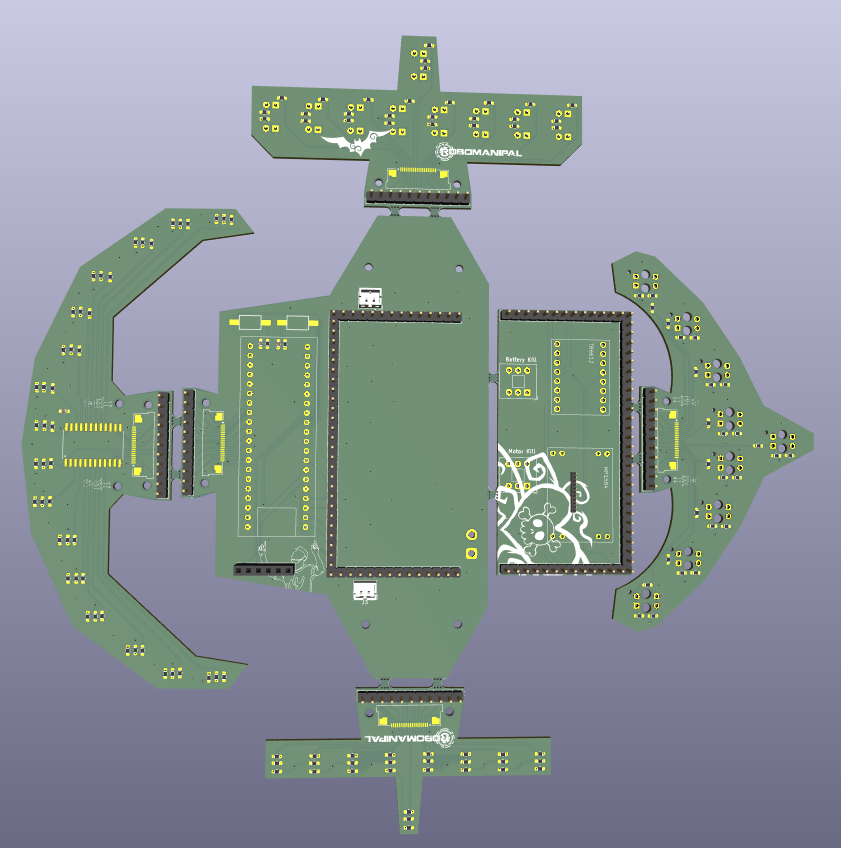
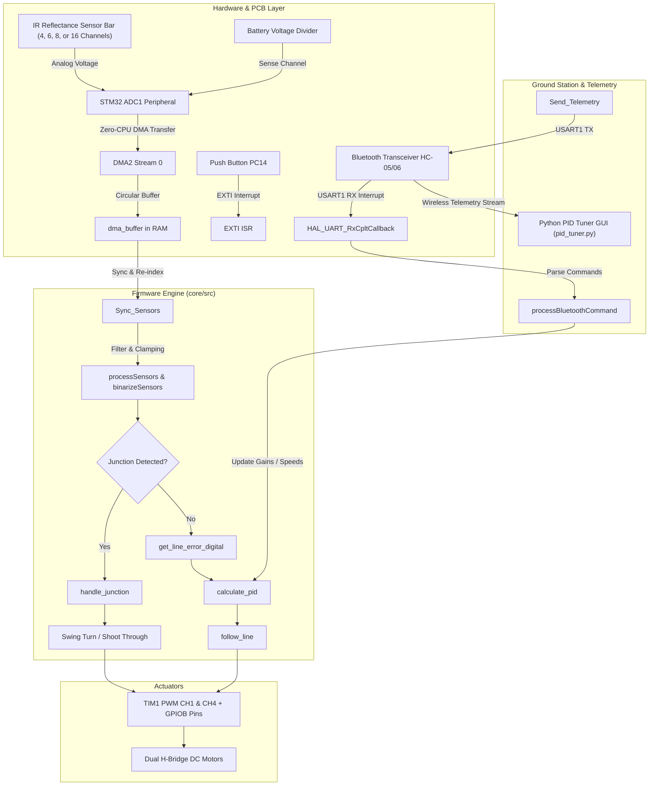
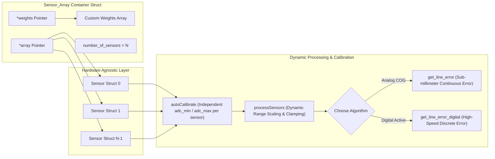

# ⚡ High-Speed STM32 Line Follower Robot with Real-Time Python PID Tuner & Modular PCB Platform

[](https://www.st.com/)
[](https://en.wikipedia.org/wiki/C_(programming_language))
[](pid_tuner.py)
[](README.md)
[](LICENSE)

An advanced, high-speed line follower robot platform engineered on the **STM32F4** ARM Cortex-M4 microcontroller and a **custom modular hardware architecture**. This system features **zero-CPU-overhead continuous ADC sampling via DMA**, **closed-loop PID steering control with dynamic time-delta computation**, **real-time battery voltage compensation**, and a **hardware-agnostic, modular sensor processing engine** paired with interchangeable custom PCB sensor arrays. 

Included in this repository is a custom desktop GUI application ([`pid_tuner.py`](pid_tuner.py)) that streams real-time telemetry over Bluetooth/UART, plots line error, correction outputs, and motor speeds at ~60ms intervals, and allows live gain tuning without reflashing firmware.

---

## 🖼️ Hardware & Bot Gallery

| 🤖 Complete Robot Picture | 🛠️ Main Control PCB |
| :---: | :---: |
|  <br> |  <br> *Main Control & Power Board* |

| 📐 MCU & Control Schematic | 🧊 3D PCB Viewer Render |
| :---: | :---: |
|  <br> |  <br> |

---

## 📑 Detailed Module & Hardware Documentation Links

- 🛠️ [**Modular PCB Hardware Architecture**](https://github.com/alientanya/line-follower-PCB)
- 📊 [**Modular Sensor Module Architecture (`docs/sensor_module.md`)**](docs/sensor_module.md)
- 📡 [**Main System Architecture & Control Loop Logic (`docs/main.md`)**](docs/main.md)
- ⚡ [**Motor Control & Battery Voltage Compensation (`docs/motor.md`)**](docs/motor.md)
- 🖥️ [**Python PID Tuner Dashboard Guide & Protocol (`docs/pid_tuner.md`)**](docs/pid_tuner.md)
- 📶 [**Bluetooth Communication Module (`docs/bluetooth.md`)**](docs/bluetooth.md)
- 🛠️ [**Utility Helpers & Voltage Conversion Math (`docs/utils.md`)**](docs/utils.md)
- 📚 [**Documentation Index (`docs/README.md`)**](docs/README.md)

---

## 🌟 Key Features & Highlights

- **⚡ Zero-CPU-Overhead Sensor Acquisition**: Uses STM32 ADC1 in continuous multi-channel scan mode paired with DMA2 Stream 0 to transfer 12-bit sensor data into RAM asynchronously.
- **🧱 Modular & Hardware-Agnostic Sensor Architecture**: The core sensor module ([`core/src/sensor_module.c`](core/src/sensor_module.c)) decouples physical array hardware from navigation math. Supports any IR array size (4, 6, 8, 12, 16 sensors), custom positional weights, dynamic per-sensor min/max auto-calibration, and analog or digital line-error algorithms.
- **🎛️ 4 Interchangeable Sensor Array PCBs**: Common header interface supporting 16-sensor curved QRE arrays, 9-sensor QRE straight arrays, 9-sensor TCRT5000 arrays, and discrete IR LED/phototransistor arrays.
- **🔋 Battery Voltage Compensation**: Continuously measures battery voltage on a dedicated ADC channel and dynamically scales motor PWM duty cycles to maintain uniform speed as the battery depletes.
- **🧭 Automatic Junction Detection & Maneuvers**: Pattern-matching classifiers detect T-junctions, 90° left/right turns, and cross intersections, executing specialized turn routines.
- **📊 Real-Time Python PID Dashboard**: Custom Tkinter/Matplotlib GUI ([`pid_tuner.py`](pid_tuner.py)) featuring dual Y-axis plots, live 12-bit IR bar charts, CSV recording/exporting, debug packet logging, and a built-in step-by-step PID tuning guide.

---

## 🏗️ System Architecture



---

## 🛠️ Modular PCB Hardware Architecture

The robot is built on a custom modular PCB platform designed to prioritize sensor experimentation and component flexibility. Instead of committing to a single sensor layout, this board allows four distinct sensor array designs to be used interchangeably without redesigning the core electronics.

### Core Hardware Components & Design Choices

#### 🧠 Microcontroller — STM32F411 (Blackpill) 
- High-speed multi-channel ADC for ultra-fast sensor sampling
- Rich GPIO availability and timer hardware for motor PWM
- Plug-in module form factor for rapid replacement

#### ⚡ Motor Driver — TB6612FNG 
- Dual H-Bridge DC motor driver
- Superior thermal efficiency and compact footprint for micro N20 motors

#### 🔋 Voltage Regulation — MP1584 Buck Converter 
- Step-down buck regulator delivering a stable 3.3V power rail to MCU & optical sensors
- High efficiency for extended LiPo battery operation

#### 📶 Communication — HC-05 Bluetooth Module 
- UART-based serial Bluetooth transceiver
- Enables wireless real-time telemetry streaming and remote PID gain tuning
- Supports hardware `STATE` and `EN` pin control

#### 🔀 Analog Multiplexer — 74HC4067 
- 16-channel analog MUX integrated into the high-density sensor bar
- Expands sensor capacity while minimizing MCU pin requirements

---

### 🔌 Interchangeable Sensor Array PCBs

All array PCBs share a standardized header connector interface, making them plug-and-play compatible with the main control PCB.

| Sensor Array Design | Key Specifications & Use Cases |
| :--- | :--- |
| **1. 16-Sensor Curved Array (QRE1113 + MUX)** | • High-resolution optical tracking<br>• Multiplexed via 74HC4067<br>• Curved geometry designed for aggressive tight turns |
| **2. 9-Sensor Straight Array (QRE1113)** | • Direct MCU ADC inputs<br>• Minimum latency & zero CPU multiplexing overhead<br>• Ideal for high-speed straightaways |
| **3. 9-Sensor Curved Array (TCRT5000)** | • High surface and ride-height tolerance<br>• Larger optical focal distance<br>• Forward-slight arc improves line re-acquisition |
| **4. Custom Sensor Array (IR LED + PT334 6C)** | • Discrete phototransistor design<br>• Fully customizable gain resistors & optical spectrum tuning |

---

### 🎯 8+1 Sensor Placement Strategy

- **8 Main Track Sensors**: Positioned across the primary line axis for continuous line position calculation and steering feedback.
- **+1 Front Outrigger Sensor**: Mounted ahead of the main array to detect track overshoot, sharp right-angle turns, and cross junctions early, allowing predictive motor braking.

---

### 🎛️ Main Control PCB & Chassis Design

The main board manages system power distribution, MCU signals, motor drivers, and chassis integration:

- **Component Integration**: Hosts the STM32F411 Blackpill, TB6612FNG driver, MP1584 converter, and HC-05 Bluetooth module.
- **Noise Isolation**: Logic and motor power grounds are isolated with decoupling capacitors to prevent inductive switching noise on analog ADC channels.
- **Dual Physical Safety Switches**:
  - **Motor Kill Switch**: Instantly cuts motor power while preserving MCU logic & telemetry for safe desktop debugging.
  - **Battery Switch**: Complete power isolation.
- **Debounced User Controls**: 2 hardware-debounced RC push buttons for starting, stopping, and triggering dynamic auto-calibration routines.
- **Stacked PCB Chassis System**: Mounts directly to the upper chassis frame using standoffs, creating an internal battery bay between layers.

<div align="center">
  <br>
  <sub><b>Main Control PCB Board Layout</b></sub>
</div>

---

### 📐 Control Schematic

<div align="center">
  <br>
  <sub><b>MCU Control & Interfacing Schematic</b></sub>
</div>

---

## 🧩 Modular Sensor Module Architecture (`sensor_module.c`)

> [!NOTE]
> 📖 **Full Dedicated Documentation**: For a complete function-by-function reference, pipeline breakdown, and mathematical derivations, see the standalone [**Sensor Module Architecture Guide (`docs/sensor_module.md`)**](docs/sensor_module.md).

One of the standout features of this project is its **completely modular and hardware-decoupled sensor subsystem** implemented in [`core/src/sensor_module.c`](core/src/sensor_module.c) and [`core/inc/types.h`](core/inc/types.h).

> [!IMPORTANT]
> Unlike standard line follower codebases that hardcode sensor pin counts or specific sensor models, this architecture abstracts sensor hardware into dynamic data structures.



### Why This Design is Superior:

1. **Any Array Size ($N$ Sensors)**:
   Change `number_of_sensors` in [`main.c`](core/src/main.c) or runtime config. Supports 4, 6, 8, 12, or 16-channel sensor bars (e.g., Pololu QTR-8A, QTR-8D, TCRT5000 arrays, or custom phototransistor boards) without modifying calculation code.
2. **Custom Positional Weighting**:
   Assign any integer weight array (e.g., `{-4, -3, -2, -1, 1, 2, 3, 4}` or non-linear `{-8, -4, -2, -1, 1, 2, 4, 8}`) to match physical sensor geometry.
3. **Per-Sensor Independent Auto-Calibration**:
   [`autoCalibrate`](docs/sensor_module.md#3-autocalibrate) spins the robot over the track to record independent `adc_min` and `adc_max` bounds for each individual sensor, compensating for manufacturing variations and height offsets.
4. **Dual Line Position Algorithms**:
   - **Continuous Analog Mode** ([`get_line_error`](docs/sensor_module.md#6-get_line_error)):
     $$\text{Position Error} = \frac{\sum (v_i \times w_i)}{\sum v_i}$$
     *(where $v_i$ is mapped analog intensity and $w_i$ is sensor weight)*
   - **Discrete Digital Mode** ([`get_line_error_digital`](docs/sensor_module.md#7-get_line_error_digital)):
     $$\text{Position Error} = \frac{\sum_{\text{active}} w_i}{N_{\text{active}}}$$
     *(where $w_i$ is active sensor weight and $N_{\text{active}}$ is total active sensors)*

👉 *Read the full standalone [**Sensor Module Documentation (`docs/sensor_module.md`)**](docs/sensor_module.md) for deep-dive details.*

---

## 📖 Complete Replication & User Guide

Follow this guide to build, wire, flash, and tune your own STM32 line follower robot.

### 1. Hardware Requirements

| Component | Recommended Part | Function |
| :--- | :--- | :--- |
| **Microcontroller** | STM32F401RE / STM32F411CE Black Pill / Nucleo | Main processing MCU |
| **IR Sensor Bar** | Modular PCB Array (16-QRE / 9-QRE / 9-TCRT / Custom) | Line detection (Connected to ADC1 CH0–CH7 or via MUX) |
| **Motor Driver** | TB6612FNG Dual H-Bridge Module | Motor power control (PWM on TIM1 CH1 & CH4) |
| **DC Motors** | N20 12V 600RPM Micro Gear Motors + High-Grip Wheels | Drive actuators |
| **Bluetooth Module** | HC-05 / HC-06 Transceiver | Wireless telemetry & tuning (USART1 9600 baud) |
| **Battery & Voltage Divider** | 3S LiPo (11.1V–12.6V) + 10kΩ / 3.3kΩ Divider | Power supply & battery voltage sensing (ADC1 CH9) |
| **Push Buttons** | 2x Tactile Push Buttons | Control triggers & calibration (Connected to `PC14` EXTI) |

---

### 2. Wiring & Pinout Table

| STM32 Pin | Peripheral Function | Connected Hardware |
| :--- | :--- | :--- |
| `PA0` – `PA7` | `ADC1_IN0` – `ADC1_IN7` | IR Sensors 1 to 8 (ADC DMA) |
| `PB1` | `ADC1_IN9` | Battery Voltage Sensing (Resistor Divider) |
| `PB12` | `GPIO_Output` | Left Motor Backward (IN2) |
| `PB13` | `GPIO_Output` | Left Motor Forward (IN1) |
| `PB14` | `GPIO_Output` | Right Motor Forward (IN3) |
| `PB15` | `GPIO_Output` | Right Motor Backward (IN4) |
| `PA8` | `TIM1_CH1` (PWM Output) | Left Motor Speed PWM |
| `PA11` | `TIM1_CH4` (PWM Output) | Right Motor Speed PWM |
| `PA9` / `PA10` | `USART1_TX` / `USART1_RX` | Bluetooth HC-05/06 TX/RX |
| `PC14` | `GPIO_EXTI14` (Falling Edge) | User Start/Stop Button |

---

### 3. Software Environment & Toolchain

1. **Firmware Toolchain**:
   - [STM32CubeIDE](https://www.st.com/en/development-tools/stm32cubeide.html) or VS Code with STM32 Extension + `arm-none-eabi-gcc`.
2. **Dashboard Toolchain**:
   - Python 3.8+
   - Install dependencies:
     ```bash
     pip install pyserial matplotlib
     ```

---

### 4. Flashing Firmware & Running Dashboard

1. Open the project workspace in STM32CubeIDE.
2. Build the project (`Ctrl+B`) and flash the `.elf` / `.bin` binary to the STM32 board via ST-Link.
3. Power on the robot and pair your computer with the Bluetooth module.
4. Launch the PID Tuner Dashboard:
   ```bash
   python pid_tuner.py
   ```
5. Select your Bluetooth COM port, click **Connect**, and observe real-time plots.

---

### 5. Step-by-Step PID Tuning Guide

> [!TIP]
> Use the built-in guide window in `pid_tuner.py` by clicking **`📖 PID Tuning Guide`**.

```
STEP 0: Reset Gains         --> Set Kp = 0.5, Ki = 0.0, Kd = 0.0. Click Send PID.
STEP 1: Tune Proportional   --> Increase Kp in steps of 0.5 until robot follows line 
                                with oscillation, then back off ~20%.
STEP 2: Tune Derivative     --> Increase Kd in steps of 0.2 to damp out oscillation.
STEP 3: Tune Integral       --> Keep Ki = 0.0 unless persistent position offset exists.
STEP 4: Adjust Speed        --> Increase Base Speed (BS) & set PID Limit ≈ Base Speed × 0.6.
```

---

## 📁 Repository Structure & Module Documentation

Below is the complete project sitemap. Click any link to access detailed module documentation:

```text
line_follower/
├── README.md                          <-- You are here (Comprehensive Project & PCB Guide)
├── pid_tuner.py                       <-- Real-time Python GUI Tuning Dashboard
├── images/                            <-- Hardware Images, Schematics & Renders
│   ├── BodyPCB.png                    <-- Main Control PCB Layout
│   ├── MCU_schematic.png              <-- System Schematic
│   ├── 16_QRE_PCB.png                 <-- 16-Sensor Curved Array
│   ├── 9_QRE_PCB.png                  <-- 9-Sensor Straight Array
│   ├── 9_TCRT_PCB.png                 <-- 9-Sensor TCRT5000 Array
│   └── 9_Custom_PCB.png               <-- Custom Phototransistor Array
├── docs/                              <-- Technical Firmware Documentation
│   ├── README.md                      <-- Documentation Index
│   ├── main.md                        <-- System Architecture & Main Loop Logic
│   ├── sensor_module.md               <-- Modular Sensor Architecture & Math
│   ├── motor.md                       <-- PWM, H-Bridge & Voltage Compensation
│   ├── bluetooth.md                   <-- Wireless Serial Protocol & Command Parser
│   ├── pid_tuner.md                   <-- Dashboard User Guide & Interactive Demo
│   └── utils.md                       <-- Math Clamping & Voltage Scaling Math
└── core/                              <-- STM32 Embedded Firmware Source
    ├── inc/
    │   ├── bluetooth.h
    │   ├── main.h
    │   ├── motor.h
    │   ├── sensor_module.h
    │   ├── types.h                    <-- Core Structures (Sensor, Sensor_Array, PID)
    │   └── utils.h
    └── src/
        ├── bluetooth.c                <-- Bluetooth UART Handler
        ├── main.c                     <-- Application Entry Point & Control Loop
        ├── motor.c                    <-- Motor Driver & Junction Maneuvers
        ├── sensor_module.c            <-- Modular Sensor Engine & PID Calculation
        └── utils.c                    <-- Utility Conversion Functions
```

---

## 🔬 Hardware Design Considerations & Lessons Learned

- **Tradeoff between Sensor Resolution and Sampling Speed**: High-density 16-sensor arrays using multiplexers (74HC4067) provide finer spatial resolution for sharp curves, whereas direct ADC 8/9-sensor arrays offer absolute minimal sampling latency for maximum speed.
- **Power Isolation**: Separating logic power and motor power rails (along with strategic decoupling capacitors) prevents inductive motor switching noise from bleeding into high-resolution 12-bit ADC sensor readings.
- **Modular Sensor Interface**: Designing standardized connector pinouts across all sensor arrays allows rapid hardware iteration without refactoring firmware pin definitions.
- **Off-the-Shelf Module Integration**: Utilizing modular daughterboards (Blackpill MCU, TB6612 driver, MP1584 buck converter) ensures high reliability, ease of repair, and quick component swapping.

---

## 🚀 Future Improvements

1. **Lighter Body Chassis**: Optimizing PCB copper layer thickness and cutouts to reduce overall robot weight and rotational inertia.
2. **Smaller Battery**: Transitioning to compact micro LiPo packs optimized specifically for competition heat run durations.
3. **Suction Downforce Technology**: Implementing an integrated ducted fan downforce system to increase cornering grip without adding static mass.
4. **Improved Wheel Traction**: Custom silicone-molded tires for superior cornering acceleration.
5. **Enhanced Circuit Protection**: Adding TVS diodes and reverse polarity protection on main power inputs.
6. **Onboard Sensor LEDs**: Placing SMD diagnostic LEDs directly on sensor array PCBs for instant visual confirmation of line state during bench testing.

---

## 📜 License

This project is open-source under the [MIT License](LICENSE).
