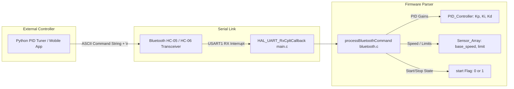

# Bluetooth Communication Module (`bluetooth.c`) Documentation

This document explains the serial communication interface implemented in [`core/src/bluetooth.c`](file:///H:/Jaishnu/stm_workspace_2/line_follower/core/src/bluetooth.c). The module manages UART string transmission and command parsing over Bluetooth (`USART1`), allowing live gain tuning, speed adjustments, and state toggles from external controllers like [`pid_tuner.py`](file:///H:/Jaishnu/stm_workspace_2/line_follower/docs/pid_tuner.md).

---

## Table of Contents
1. [Communication Protocol Architecture](#communication-protocol-architecture)
2. [Command Parsing Reference](#command-parsing-reference)
3. [Function Reference](#function-reference)
   - [`bt_send`](#1-bt_send)
   - [`processBluetoothCommand`](#2-processbluetoothcommand)
4. [Cross-Module Documentation Links](#cross-module-documentation-links)

---

## Communication Protocol Architecture

---

## Command Parsing Reference

Commands sent to `processBluetoothCommand` support multiple string formats:

| Command Pattern | Example Input | Target Parameter Updated | Reset Action |
| :--- | :--- | :--- | :--- |
| `PID:p,i,d` | `PID:1.5,0.0,0.8` | Sets `pid.Kp = 1.5`, `pid.Ki = 0.0`, `pid.Kd = 0.8` | Resets `pid.integral = 0`, `pid.last_error = 0` |
| `PARAM:BS<val>` | `PARAM:BS500` | Sets `sensor_array.base_speed = 500` | None |
| `START` | `START` | Sets `start = 1` (Active run mode) | Begins closed-loop tracking |
| `STOP` | `STOP` | Sets `start = 0` (Stopped mode) | Cuts motor power immediately |
| `P<val>` | `P2.0` | Sets `pid.Kp = 2.0` | None |
| `I<val>` | `I0.05` | Sets `pid.Ki = 0.05` | None |
| `D<val>` | `D0.8` | Sets `pid.Kd = 0.8` | None |
| `B<val>` | `B600` | Sets `sensor_array.base_speed = 600` | None |
| `X` | `X` | Sets `start = 0` (Stop) | Cuts motor power |
| `O` | `O` | Sets `start = 1` (Start) | Begins closed-loop tracking |

---

## Function Reference

### 1. `bt_send`

- **Signature**: `void bt_send(char *msg)`
- **Location**: [`bluetooth.c: L16-L18`](file:///H:/Jaishnu/stm_workspace_2/line_follower/core/src/bluetooth.c#L16-L18)
- **Parameters**: `msg` - Pointer to null-terminated ASCII string to transmit.
- **Description**: Transmits string over `USART1` using `HAL_UART_Transmit` with `HAL_MAX_DELAY` timeout.

---

### 2. `processBluetoothCommand`

- **Signature**: `void processBluetoothCommand(char *cmd, int start, PID_Controller pid, Sensor_Array sensor_array)`
- **Location**: [`bluetooth.c: L20-L65`](file:///H:/Jaishnu/stm_workspace_2/line_follower/core/src/bluetooth.c#L20-L65)
- **Parameters**:
  - `cmd`: Received command string pointer.
  - `start`: Current robot run state flag.
  - `pid`: `PID_Controller` struct instance.
  - `sensor_array`: `Sensor_Array` struct instance.
- **Description**: Parses incoming ASCII command string and updates system parameters at runtime.

---

## Cross-Module Documentation Links

- 🖥️ [Python PID Tuner Dashboard & Protocol Guide (`docs/pid_tuner.md`)](file:///H:/Jaishnu/stm_workspace_2/line_follower/docs/pid_tuner.md)
- 📡 [Main Control Loop & System Architecture (`docs/main.md`)](file:///H:/Jaishnu/stm_workspace_2/line_follower/docs/main.md)
- 📊 [Sensor Module Architecture (`docs/sensor_module.md`)](file:///H:/Jaishnu/stm_workspace_2/line_follower/docs/sensor_module.md)
- ⚡ [Motor Control & Voltage Compensation (`docs/motor.md`)](file:///H:/Jaishnu/stm_workspace_2/line_follower/docs/motor.md)
- 🛠️ [Utility Helpers Documentation (`docs/utils.md`)](file:///H:/Jaishnu/stm_workspace_2/line_follower/docs/utils.md)
- 📑 [Documentation Index (`docs/README.md`)](file:///H:/Jaishnu/stm_workspace_2/line_follower/docs/README.md)
