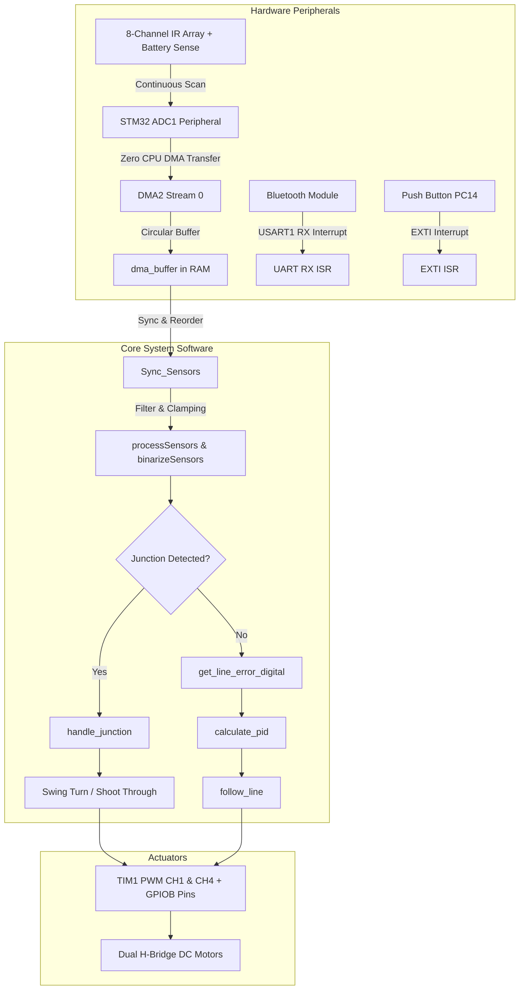
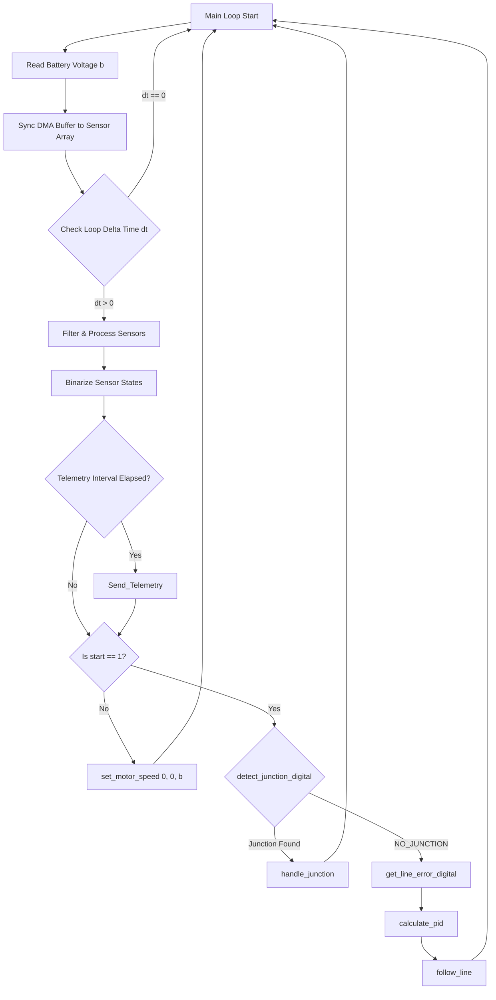

# Main System Architecture & Line-Following Logic (`main.c`)

This document provides an in-depth breakdown of the main line-following execution logic in [`core/src/main.c`](file:///H:/Jaishnu/stm_workspace_2/line_follower/core/src/main.c). It explains how Direct Memory Access (DMA), Analog-to-Digital Conversion (ADC), Pulse Width Modulation (PWM), asynchronous UART, and EXTI interrupts collaborate to execute high-speed, closed-loop line tracking.

> [!NOTE]
> Standard STM32 CubeMX hardware initialization functions (such as `MX_ADC1_Init`, `MX_TIM1_Init`, etc.) are omitted from this document to focus strictly on system architecture, hardware dataflow, and control loop logic.

---

## Table of Contents
1. [System Architecture Diagram](#system-architecture-diagram)
2. [Hardware Integration Architecture](#hardware-integration-architecture)
   - [Zero-CPU-Overhead ADC via DMA](#1-zero-cpu-overhead-adc-via-dma)
   - [PWM & Voltage-Compensated Motor Drive](#2-pwm--voltage-compensated-motor-drive)
   - [Asynchronous Bluetooth UART Command Processing](#3-asynchronous-bluetooth-uart-command-processing)
   - [GPIO EXTI Physical Interrupt Switch](#4-gpio-exti-physical-interrupt-switch)
3. [Main Loop Control Flow](#main-loop-control-flow)
   - [Detailed Step-by-Step Logic](#detailed-step-by-step-logic)
4. [Control Loop Flowchart](#control-loop-flowchart)
5. [User Function Reference](#user-function-reference)
   - [`HAL_GPIO_EXTI_Callback`](#hal_gpio_exti_callback)
   - [`HAL_UART_RxCpltCallback`](#hal_uart_rxcpltcallback)
   - [`Send_Telemetry`](#send_telemetry)
   - [`main`](#main)
6. [Cross-Module Documentation Links](#cross-module-documentation-links)

---

## System Architecture Diagram



---

## Hardware Integration Architecture

### 1. Zero-CPU-Overhead ADC via DMA

The line follower relies on continuous multi-channel sampling without blocking the CPU thread.

- **Continuous Channel Scanning**: ADC1 is configured in continuous multi-channel scan mode to cycle through 9 channels sequentially (8 IR sensor channels + 1 battery voltage sensing channel).
- **Direct Memory Access (DMA2 Stream 0)**: When an ADC conversion completes, the DMA controller automatically moves the 12-bit conversion value from the `ADC1->DR` data register into the target array [`dma_buffer`](file:///H:/Jaishnu/stm_workspace_2/line_follower/core/src/sensor_module.c#L13) in RAM.
- **Efficiency Impact**: The CPU never executes wait loops or blocking reads for ADC conversions. When the main loop runs [`Sync_Sensors(&sensor_array)`](file:///H:/Jaishnu/stm_workspace_2/line_follower/docs/sensor_module.md#2-sync_sensors), fresh 12-bit sensor data is already present in RAM.

$$\text{Battery Voltage} = \frac{\left( \frac{\text{dma\_buffer}[8] \times 3.3}{4095} \right)}{0.2475}$$

> [!TIP]
> Reading the battery voltage on the 9th channel enables continuous, real-time voltage compensation for motor speeds in [`set_motor_speed`](file:///H:/Jaishnu/stm_workspace_2/line_follower/docs/motor.md#2-set_motor_speed).

---

### 2. PWM & Voltage-Compensated Motor Drive

- **PWM Generation (TIM1)**: Timer 1 generates high-frequency PWM signals on `Channel 1` (Left Motor Speed) and `Channel 4` (Right Motor Speed) with a period register of `1000`.
- **Direction Control (GPIOB)**: H-Bridge direction pins (`PB12`, `PB13`, `PB14`, `PB15`) govern forward, reverse, and braking states.
- **Battery Compensation**: As the battery depletes from 12.4V, motor torque and speed naturally decay. The system calculates a scaling multiplier ($\frac{12.4}{V_{\text{battery}}}$) in [`utils.c`](file:///H:/Jaishnu/stm_workspace_2/line_follower/docs/utils.md#3-battery_voltage) and adjusts PWM compare values dynamically, guaranteeing uniform velocity across battery discharge cycles.

---

### 3. Asynchronous Bluetooth UART Command Processing

- **Non-Blocking Receiver**: Telemetry and control commands travel over `USART1` at 9600 baud using single-byte interrupt-driven reception (`HAL_UART_Receive_IT`).
- **Command Parser**: Incoming characters accumulate into `rx_buffer` until a newline character (`\r` or `\n`) triggers the command parser in [`HAL_UART_RxCpltCallback`](#hal_uart_rxcpltcallback).
- **Runtime Parameters**: Tuning parameters like `PID:Kp,Ki,Kd`, Base Speed (`BS`), PID Limit (`PL`), or toggle controls (`START`/`STOP`) can be adjusted live while the robot is navigating the track.

---

### 4. GPIO EXTI Physical Interrupt Switch

- **Emergency & Control Toggle**: Pin `PC14` is attached to a physical push button using an External Interrupt (EXTI 15_10 line) configured for falling-edge detection.
- **Instant Response**: Pressing the button triggers [`HAL_GPIO_EXTI_Callback`](#hal_gpio_exti_callback), toggling the global `start` flag instantly without polling delay.

---

## Main Loop Control Flow

The core infinite loop ([`main.c: L283-L333`](file:///H:/Jaishnu/stm_workspace_2/line_follower/core/src/main.c#L283-L333)) runs continuously. Here is the step-by-step logic executed during each cycle:

```
                  +----------------------------------+
                  |         Start Loop Iteration     |
                  +----------------------------------+
                                    |
                                    v
                  +----------------------------------+
                  | 1. Read Battery Voltage (b)      |
                  | 2. Sync DMA Buffer Data          |
                  +----------------------------------+
                                    |
                                    v
                  +----------------------------------+
                  | 3. Calculate Time Step (dt)      |
                  |    If dt == 0, skip cycle        |
                  +----------------------------------+
                                    |
                                    v
                  +----------------------------------+
                  | 4. Process & Binarize Sensors    |
                  +----------------------------------+
                                    |
                                    v
                  +----------------------------------+
                  | 5. Transmit Telemetry (if due)   |
                  +----------------------------------+
                                    |
                                    v
                  +----------------------------------+
                  | Is start == 1 (Robot Active)?    |
                  +----------------------------------+
                       /                        \
                     Yes                         No
                     /                            \
        +-------------------------+      +-------------------------+
        | Check Junction (j)      |      | Stop Motors Immediately |
        +-------------------------+      | set_motor_speed(0,0,b)  |
             /               \           +-------------------------+
       Junction            No Junction
          /                     \
+--------------------+   +---------------------------+
| Exec Maneuver      |   | Calculate Digital Error   |
| handle_junction()  |   | Compute PID Correction    |
+--------------------+   | follow_line(correction)   |
                         +---------------------------+
```

---

### Detailed Step-by-Step Logic

#### Step 1: Battery Voltage & DMA Sensor Synchronization
```c
b = battery_voltage(dma_buffer);
Sync_Sensors(&sensor_array);
```
- Calls [`battery_voltage(dma_buffer)`](file:///H:/Jaishnu/stm_workspace_2/line_follower/docs/utils.md#3-battery_voltage) to convert raw ADC channel 9 into volts.
- Calls [`Sync_Sensors(&sensor_array)`](file:///H:/Jaishnu/stm_workspace_2/line_follower/docs/sensor_module.md#2-sync_sensors) to map raw DMA values (`dma_buffer[7..0]`) into the sensor array in physical left-to-right alignment.

#### Step 2: High-Precision Loop Delta Time (`dt`) Calculation
```c
uint32_t current_time = HAL_GetTick();
uint32_t time_diff = current_time - last_time;

if (time_diff == 0) {
    continue;
} else {
    dt = time_diff / 1000.0f;
    last_time = current_time;
}
```
- Calculates time elapsed since the previous cycle in seconds (`dt`).
- If `time_diff == 0` (less than 1 ms elapsed), the loop immediately skips to the next cycle to prevent division-by-zero errors in derivative PID computations.

#### Step 3: Sensor Processing & Binarization
```c
processSensors(&sensor_array);
binarizeSensors(&sensor_array);
```
- [`processSensors`](file:///H:/Jaishnu/stm_workspace_2/line_follower/docs/sensor_module.md#4-processsensors): Clamps background surface noise (`adc_raw <= 1500` set to 0).
- [`binarizeSensors`](file:///H:/Jaishnu/stm_workspace_2/line_follower/docs/sensor_module.md#5-binarizesensors): Compares filtered values to threshold bounds to produce binary `on = 1` or `on = 0` digital flags for each sensor.

#### Step 4: Periodic Telemetry Transmission
```c
if ((HAL_GetTick() - last_telem) >= TELEM_INTERVAL_MS) {
    last_telem = HAL_GetTick();
    Send_Telemetry();
}
```
- Sends system status (IR values, motor duty cycles, battery voltage, line error, PID output, junction type) over Bluetooth at fixed intervals without interrupting main loop execution.

#### Step 5: Execution Mode Evaluation

> [!IMPORTANT]
> The robot's operational state is governed by the `start` flag.

- **When `start == 1` (Active Run Mode)**:
  1. **Junction Detection**: Evaluates current sensor pattern via [`detect_junction_digital(&sensor_array)`](file:///H:/Jaishnu/stm_workspace_2/line_follower/docs/sensor_module.md#11-detect_junction_digital).
  2. **Junction Handling**: If a junction is detected (`LEFT_JUNCTION`, `RIGHT_JUNCTION`, or `T_JUNCTION`), calls [`handle_junction(&sensor_array, j, 600)`](file:///H:/Jaishnu/stm_workspace_2/line_follower/docs/motor.md#7-handle_junction) to execute automated turn maneuvers (`swing_turn_left`, `swing_turn_right`, or `shoot_through`).
  3. **Line Tracking & PID Steering**: If no junction is present (`NO_JUNCTION`):
     - Calculates digital line position error: [`line = get_line_error_digital(&sensor_array)`](file:///H:/Jaishnu/stm_workspace_2/line_follower/docs/sensor_module.md#7-get_line_error_digital).
     - Computes PID steering correction: [`correction = calculate_pid(&pid, line, dt)`](file:///H:/Jaishnu/stm_workspace_2/line_follower/docs/sensor_module.md#8-calculate_pid).
     - Updates differential motor speeds: [`follow_line(correction, &sensor_array)`](file:///H:/Jaishnu/stm_workspace_2/line_follower/docs/motor.md#3-follow_line).

- **When `start == 0` (Stopped Mode)**:
  - Immediately cuts motor power via [`set_motor_speed(0, 0, b)`](file:///H:/Jaishnu/stm_workspace_2/line_follower/docs/motor.md#2-set_motor_speed).

---

## Control Loop Flowchart



---

## User Function Reference

### `HAL_GPIO_EXTI_Callback`

- **Signature**: `void HAL_GPIO_EXTI_Callback(uint16_t GPIO_Pin)`
- **Location**: [`main.c: L105-L119`](file:///H:/Jaishnu/stm_workspace_2/line_follower/core/src/main.c#L105-L119)
- **Parameters**: `GPIO_Pin` - Pin identifier triggering interrupt.
- **Description**: Hardware EXTI interrupt service routine. Toggles `start` state when push button (`PC14`) is pressed.

---

### `HAL_UART_RxCpltCallback`

- **Signature**: `void HAL_UART_RxCpltCallback(UART_HandleTypeDef *huart)`
- **Location**: [`main.c: L123-L183`](file:///H:/Jaishnu/stm_workspace_2/line_follower/core/src/main.c#L123-L183)
- **Parameters**: `huart` - Pointer to UART peripheral handle (`USART1`).
- **Description**: Handles incoming serial bytes from Bluetooth, parses complete strings (`PID:`, `PARAM:`, `START`, `STOP`, single char commands), and re-arms UART RX interrupt.

---

### `Send_Telemetry`

- **Signature**: `void Send_Telemetry(void)`
- **Location**: [`main.c: L188-L213`](file:///H:/Jaishnu/stm_workspace_2/line_follower/core/src/main.c#L188-L213)
- **Description**: Assembles and transmits a formatted telemetry status string over `USART1` containing IR sensor mapped values, power levels, battery voltage, line error, correction value, and junction state.

---

### `main`

- **Signature**: `int main(void)`
- **Location**: [`main.c: L221-L335`](file:///H:/Jaishnu/stm_workspace_2/line_follower/core/src/main.c#L221-L335)
- **Description**: Application entry point. Sets initial PID parameters, configures sensor weights and base speed, launches PWM timers, starts ADC DMA sampling, and enters the infinite control loop.

---

## Cross-Module Documentation Links

- 📡 [Sensor Module Documentation (`docs/sensor_module.md`)](file:///H:/Jaishnu/stm_workspace_2/line_follower/docs/sensor_module.md) - Detailed analysis of DMA buffer syncing, sensor calibration, line error calculation algorithms, and junction detection.
- ⚡ [Motor Control Documentation (`docs/motor.md`)](file:///H:/Jaishnu/stm_workspace_2/line_follower/docs/motor.md) - PWM output logic, H-bridge direction control, battery voltage compensation equations, and turn maneuvers.
- 📶 [Bluetooth Module Documentation (`docs/bluetooth.md`)](file:///H:/Jaishnu/stm_workspace_2/line_follower/docs/bluetooth.md) - Telemetry transmission routines and string command parsing.
- 🛠️ [Utility Helpers Documentation (`docs/utils.md`)](file:///H:/Jaishnu/stm_workspace_2/line_follower/docs/utils.md) - Mathematical clamping utilities and ADC-to-voltage conversion math.
- 📑 [Documentation Index (`docs/README.md`)](file:///H:/Jaishnu/stm_workspace_2/line_follower/docs/README.md) - Complete sitemap for the project documentation.
