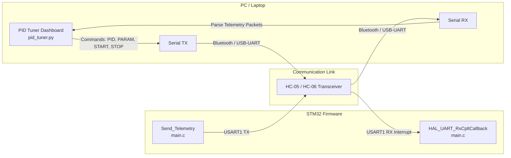
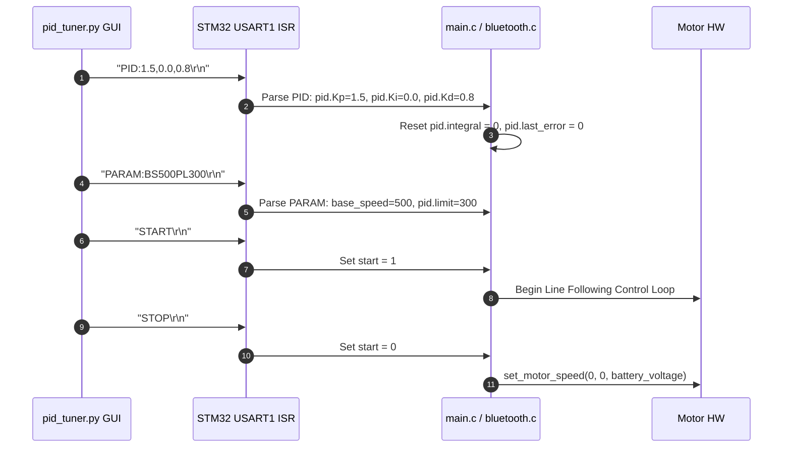

# PID Tuner Dashboard (`pid_tuner.py`) Documentation & Usage Demo

This document provides complete user guide documentation and architectural details for [`pid_tuner.py`](file:///H:/Jaishnu/stm_workspace_2/line_follower/pid_tuner.py), a real-time desktop dashboard built with Python (`tkinter` + `matplotlib` + `pyserial`). It allows live visual tuning, real-time plotting, packet logging, and bidirectional serial/Bluetooth communication with the STM32 line follower robot.

---

## Table of Contents
1. [Overview](#overview)
2. [Prerequisites & Quick Start](#prerequisites--quick-start)
3. [Interactive Usage Demo & Walkthrough](#interactive-usage-demo--walkthrough)
   - [Step 1: Connecting to the Robot](#step-1-connecting-to-the-robot)
   - [Step 2: Real-time Plotting & Telemetry Monitoring](#step-2-real-time-plotting--telemetry-monitoring)
   - [Step 3: Sending PID & Motion Parameters](#step-3-sending-pid--motion-parameters)
   - [Step 4: Using the Built-In PID Tuning Guide](#step-4-using-the-built-in-pid-tuning-guide)
   - [Step 5: Data Recording & CSV Export](#step-5-data-recording--csv-export)
   - [Step 6: Debug Monitor Tab](#step-6-debug-monitor-tab)
4. [Serial Communication Protocol (`pid_tuner.py` ↔ `main.c`)](#serial-communication-protocol-pid_tunerpy--mainc)
   - [Robot to Dashboard (Telemetry Stream)](#1-robot-to-dashboard-telemetry-stream)
   - [Dashboard to Robot (Control Commands)](#2-dashboard-to-robot-control-commands)
5. [Dashboard Architecture & Component Reference](#dashboard-architecture--component-reference)

---

## Overview

[`pid_tuner.py`](file:///H:/Jaishnu/stm_workspace_2/line_follower/pid_tuner.py) functions as a real-time ground control station for the robot. Instead of reflashing firmware to adjust $K_p$, $K_i$, $K_d$, base speeds, or correction limits, engineers can tune parameters wirelessly over Bluetooth and instantly analyze the impact on error signals, correction outputs, and motor PWM.



---

## Prerequisites & Quick Start

### Python Requirements
Install the required dependencies via `pip`:
```bash
pip install pyserial matplotlib
```

> [!NOTE]
> `tkinter` comes pre-installed with Python on Windows and macOS. On Linux distributions (e.g., Ubuntu/Debian), install it via `sudo apt install python3-tk`.

### Launching the Application
Run the script from the root workspace directory:
```bash
python pid_tuner.py
```

---

## Interactive Usage Demo & Walkthrough

### Step 1: Connecting to the Robot
1. Power on the STM32 line follower robot and pair your computer's Bluetooth with the HC-05/HC-06 module (or connect via USB-to-UART adapter).
2. In the top bar of the dashboard:
   - Click **`↻`** to refresh available COM ports.
   - Select the target port (e.g., `COM4` on Windows or `/dev/ttyUSB0` on Linux).
   - Select the Baud rate (default: `9600`).
3. Click **Connect**. The status indicator turns green (`● Connected (COM4)`) and packet rate data appears.

---

### Step 2: Real-time Plotting & Telemetry Monitoring

The **📊 PID Plots** tab features three real-time charts synchronized at ~60ms intervals:

1. **Dual Y-Axis Line Error & PID Correction Chart** (Top Full-Width):
   - **Cyan Line**: Real-time line position error ($e$).
   - **Dashed White Line**: Target Setpoint ($0$).
   - **Orange Line (Right Y-Axis)**: Calculated PID correction output.
2. **Motor Speeds Chart** (Bottom Left):
   - **Blue Line**: Left motor PWM speed.
   - **Purple Line**: Right motor PWM speed.
3. **Live IR Sensors Bar Chart** (Bottom Right):
   - Dynamic bar chart showing raw 12-bit ADC values for each connected sensor ($0$ to $4095$).
   - Bars automatically turn **Cyan** when over background, and **Red** when over the black line ($< 0.45 \times 4095$).
   - If physical pin order is reversed, click **`⇄ Flip IR Order`** on the sidebar to flip the display orientation.

---

### Step 3: Sending PID & Motion Parameters

```
+------------------------------------+
|            PID Parameters          |
|  Kp: [ 1.5 ]  Ki: [ 0.0 ] Kd: [0.8]|
|  [ Send PID ]                      |
+------------------------------------+
                 |
                 v  Transmits: "PID:1.5,0.0,0.8\r\n"
+------------------------------------+
|            STM32 Robot             |
|  Updates pid.Kp, Ki, Kd instantly  |
|  Resets integral & last_error      |
+------------------------------------+
```

#### Adjusting PID Gains
- Enter target values into **Kp**, **Ki**, and **Kd** fields.
- Click **Send PID**. Transmits `PID:Kp,Ki,Kd` over UART.

#### Adjusting Speed & Correction Limits
- Enter target **Base Spd** (e.g., `500`) and **PID Limit** (e.g., `300`).
- Click **Send Params**. Transmits `PARAM:BS<speed>PL<limit>` over UART.

#### Start / Stop Controls
- Click **▶ START**: Sends `"START"` command over serial.
- Click **■ STOP**: Sends `"STOP"` command, immediately stopping both motors.

---

### Step 4: Using the Built-In PID Tuning Guide

Click **`📖 PID Tuning Guide`** on the sidebar to launch an interactive window explaining step-by-step tuning:

> [!TIP]
> **Recommended Tuning Procedure**:
> 1. **Step 0 — Reset**: Set $K_p = 0.5, K_i = 0.0, K_d = 0.0$.
> 2. **Step 1 — Tune $K_p$**: Increase $K_p$ in steps of 0.5 until the robot follows the line but oscillates (zigzags), then back off ~20%.
> 3. **Step 2 — Tune $K_d$**: Increase $K_d$ in steps of 0.2 to damp out oscillations without causing high-frequency spikes on the orange correction line.
> 4. **Step 3 — Tune $K_i$**: Keep $K_i = 0.0$ or set a small value ($0.01 - 0.1$) only if steady-state position offset remains.
> 5. **Step 4 — Base Speed & Limits**: Increase base speed and set PID Limit $\approx \text{Base Speed} \times 0.6$.

---

### Step 5: Data Recording & CSV Export

1. Click **`⏺ Record`** to start capturing timestamped telemetry rows. Button turns red (`⏺ Stop Rec`).
2. Run your line-following test drive.
3. Click **`⏺ Stop Rec`**, then click **`💾 Export CSV`**.
4. Choose a file path to export recorded data for analysis in Python, Excel, or MATLAB.

---

### Step 6: Debug Monitor Tab

Switch to the **🔍 Debug Monitor** tab for low-level diagnostics:

- **DMA Buffer / Raw ADC Values**: Canvas visualization of raw ADC conversion readings per channel.
- **Telemetry Cards**: Large digital readouts for Battery, Line Error, Correction, Motor Speeds, and Junction Type (`NONE`, `LEFT`, `RIGHT`, `T-JUNC`, `CROSS`).
- **Sensor Detection Bar**: Binary indicator lights (`S1 ●` to `S8 ○`) showing exact line detection states.
- **Send Raw Command**: Input field to send arbitrary ASCII command strings directly over serial.
- **Packet Log**: Scrollable live log terminal showing raw incoming telemetry packet strings.

---

## Serial Communication Protocol (`pid_tuner.py` ↔ `main.c`)

### 1. Robot to Dashboard (Telemetry Stream)

[`Send_Telemetry()`](file:///H:/Jaishnu/stm_workspace_2/line_follower/docs/main.md#send_telemetry) in [`core/src/main.c`](file:///H:/Jaishnu/stm_workspace_2/line_follower/core/src/main.c#L188-L213) transmits semicolon-delimited ASCII strings terminated by `\n` at fixed intervals (`TELEM_INTERVAL_MS`):

```text
IR:120,140,3200,3100,150,130,120,110;PL:580;PR:420;BV:12.2;PE:4.0;PO:80.0;JC:0\n
```

| Packet Key | Meaning | Dashboard Parsing Destination |
| :--- | :--- | :--- |
| `IR` | Comma-separated array of raw/mapped IR sensor readings | Updated in live bar chart and DMA canvas. |
| `PL` | Left motor PWM speed | Plotted on Motor Speeds chart (Blue). |
| `PR` | Right motor PWM speed | Plotted on Motor Speeds chart (Purple). |
| `BV` | Battery voltage in Volts | Displayed in live sidebar & debug card. |
| `PE` | Position error ($e$) | Plotted on Error/Correction chart (Cyan). |
| `PO` | PID correction output | Plotted on Error/Correction chart (Orange). |
| `JC` | Junction type enum index (`0..6`) | Displayed as readable string (`NONE`, `LEFT`, `RIGHT`, `T-JUNC`). |

---

### 2. Dashboard to Robot (Control Commands)

Commands sent from `pid_tuner.py` are received by `USART1` interrupts and processed in [`HAL_UART_RxCpltCallback`](file:///H:/Jaishnu/stm_workspace_2/line_follower/docs/main.md#hal_uart_rxcpltcallback) in [`main.c`](file:///H:/Jaishnu/stm_workspace_2/line_follower/core/src/main.c#L123-L183) & [`bluetooth.c`](file:///H:/Jaishnu/stm_workspace_2/line_follower/docs/bluetooth.md#2-processbluetoothcommand):



---

## Dashboard Architecture & Component Reference

Below is a map of the core Python methods in [`pid_tuner.py`](file:///H:/Jaishnu/stm_workspace_2/line_follower/pid_tuner.py):

| Method Name | Location | Description |
| :--- | :--- | :--- |
| `_build_ui()` | [`pid_tuner.py: L106`](file:///H:/Jaishnu/stm_workspace_2/line_follower/pid_tuner.py#L106) | Builds top connection bar, dark theme styles, sidebar cards, and notebook tabs. |
| `_build_plots()` | [`pid_tuner.py: L303`](file:///H:/Jaishnu/stm_workspace_2/line_follower/pid_tuner.py#L303) | Configures Matplotlib GridSpec layout for dual-axis error/correction, motor speeds, and IR bar chart. |
| `_build_debug_tab()` | [`pid_tuner.py: L408`](file:///H:/Jaishnu/stm_workspace_2/line_follower/pid_tuner.py#L408) | Constructs raw DMA canvas, telemetry cards, binary sensor indicator bar, and packet log. |
| `_reader()` | [`pid_tuner.py: L659`](file:///H:/Jaishnu/stm_workspace_2/line_follower/pid_tuner.py#L659) | Background thread continuously reading bytes from serial port and splitting lines. |
| `_parse(line)` | [`pid_tuner.py: L678`](file:///H:/Jaishnu/stm_workspace_2/line_follower/pid_tuner.py#L678) | Parses key-value pairs from telemetry string into data deques (`err`, `corr`, `lspd`, `rspd`, `batt`). |
| `_send_pid()` | [`pid_tuner.py: L782`](file:///H:/Jaishnu/stm_workspace_2/line_follower/pid_tuner.py#L782) | Reads $K_p, K_i, K_d$ from entries and transmits `"PID:p,i,d"`. |
| `_send_params()` | [`pid_tuner.py: L789`](file:///H:/Jaishnu/stm_workspace_2/line_follower/pid_tuner.py#L789) | Reads base speed and PID limit and transmits `"PARAM:BS<bs>PL<pl>"`. |
| `_show_guide()` | [`pid_tuner.py: L803`](file:///H:/Jaishnu/stm_workspace_2/line_follower/pid_tuner.py#L803) | Opens non-blocking Toplevel window with step-by-step PID tuning manual and diagnostic patterns. |
| `_tick()` | [`pid_tuner.py: L1001`](file:///H:/Jaishnu/stm_workspace_2/line_follower/pid_tuner.py#L1001) | Main thread GUI update loop executed every ~60ms to refresh charts, debug canvas, and labels. |

---

## Cross-Module Documentation Links

- 📡 [Main System Architecture & Line-Following Logic (`docs/main.md`)](file:///H:/Jaishnu/stm_workspace_2/line_follower/docs/main.md)
- 📊 [Sensor Module Documentation (`docs/sensor_module.md`)](file:///H:/Jaishnu/stm_workspace_2/line_follower/docs/sensor_module.md)
- ⚡ [Motor Control Documentation (`docs/motor.md`)](file:///H:/Jaishnu/stm_workspace_2/line_follower/docs/motor.md)
- 📶 [Bluetooth Communication Module (`docs/bluetooth.md`)](file:///H:/Jaishnu/stm_workspace_2/line_follower/docs/bluetooth.md)
- 🛠️ [Utility Helpers Documentation (`docs/utils.md`)](file:///H:/Jaishnu/stm_workspace_2/line_follower/docs/utils.md)
- 📑 [Documentation Index (`docs/README.md`)](file:///H:/Jaishnu/stm_workspace_2/line_follower/docs/README.md)
