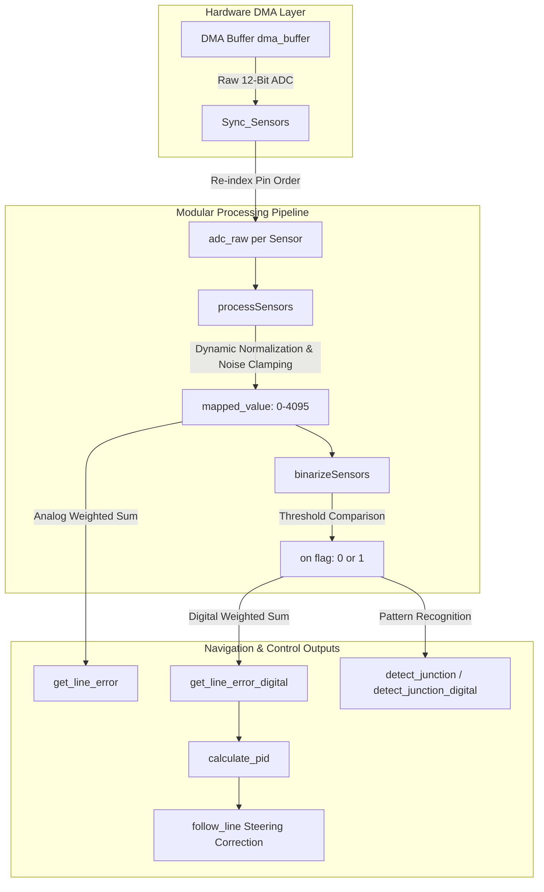

# Sensor Module (`sensor_module.c`) Architecture & Documentation

This document provides complete technical documentation for [`core/src/sensor_module.c`](file:///H:/Jaishnu/stm_workspace_2/line_follower/core/src/sensor_module.c). The module implements a **hardware-agnostic, modular sensor architecture** capable of handling arbitrary sensor array sizes, custom weighting schemes, dynamic bounds calibration, analog/digital line position estimation, PID calculation, and track junction detection.

---

## Table of Contents
1. [Modular & Hardware-Agnostic Design](#modular--hardware-agnostic-design)
2. [Data Processing Pipeline Diagram](#data-processing-pipeline-diagram)
3. [Data Structures & Globals](#data-structures--globals)
4. [Function Reference](#function-reference)
   - [`Initialize_Sensor_Array`](#1-initialize_sensor_array)
   - [`Sync_Sensors`](#2-sync_sensors)
   - [`autoCalibrate`](#3-autocalibrate)
   - [`processSensors`](#4-processsensors)
   - [`binarizeSensors`](#5-binarizesensors)
   - [`get_line_error`](#6-get_line_error)
   - [`get_line_error_digital`](#7-get_line_error_digital)
   - [`calculate_pid`](#8-calculate_pid)
   - [`count_active_sensors`](#9-count_active_sensors)
   - [`detect_junction`](#10-detect_junction)
   - [`detect_junction_digital`](#11-detect_junction_digital)
5. [Cross-Module Documentation Links](#cross-module-documentation-links)

---

## Modular & Hardware-Agnostic Design

> [!IMPORTANT]
> The sensor module is engineered to be **completely hardware-decoupled**. It does not hardcode sensor physical counts, ADC channel pinouts, or sensor manufacturer types into the underlying math algorithms.

### Key Modular Design Principles

1. **Arbitrary Sensor Array Sizes**:
   - The array length is defined dynamically by `sensor_array->number_of_sensors`.
   - Adapts seamlessly to 4, 6, 8, 12, or 16-channel sensor bars (e.g., Pololu QTR-8A, TCRT5000 arrays, or custom phototransistor boards).

2. **Custom Positional Weighting**:
   - Positional weights are passed as an array pointer (`sensor_array->weights`).
   - Allows asymmetric sensor spacing, non-linear weight scaling (e.g., `{-8, -4, -2, -1, 1, 2, 4, 8}`), or custom geometry configurations.

3. **Per-Sensor Independent Calibration**:
   - Each individual sensor retains its own dynamic `adc_min` and `adc_max` bounds.
   - Automatically compensates for physical sensor variations, LED brightness differences, or surface height shifts across the sensor bar.

4. **Dual Line-Error Estimation Modes**:
   - **Analog Center-of-Gravity Mode** (`get_line_error`): Continuous sub-millimeter position resolution based on raw analog intensity.
   - **Digital Weighted-Average Mode** (`get_line_error_digital`): Discrete binary active-sensor tracking ideal for high-contrast, high-speed tracks.

---

## Data Processing Pipeline Diagram

---

## Data Structures & Globals

- **[`Sensor`](file:///H:/Jaishnu/stm_workspace_2/line_follower/core/inc/types.h#L19-L29)**: Stores properties for a single sensor element:
  - `adc_raw`: Latest 12-bit ADC value.
  - `adc_max` / `adc_min`: Dynamic calibration lower and upper bounds.
  - `weight`: Positional weight factor relative to array center.
  - `threshold`: Threshold value for binary state transition.
  - `mapped_value`: Scaled, noise-filtered analog value.
  - `on`: Binary line presence flag (`1` or `0`).

- **[`Sensor_Array`](file:///H:/Jaishnu/stm_workspace_2/line_follower/core/inc/types.h#L32-L38)**: Top-level container managing the sensor bar:
  - `number_of_sensors`: Total active sensor count ($N$).
  - `array`: Pointer to dynamically assigned array of `Sensor` structures.
  - `weights`: Pointer to positional weights array.
  - `base_speed`: Target forward PWM base speed.

- **[`dma_buffer`](file:///H:/Jaishnu/stm_workspace_2/line_follower/core/src/sensor_module.c#L13)**: `volatile uint16_t dma_buffer[NUM_SENSORS + 1]` holds raw 12-bit ADC DMA conversion results for sensors and battery voltage.

---

## Function Reference

### 1. `Initialize_Sensor_Array`

- **Signature**: `void Initialize_Sensor_Array(Sensor_Array *sensor_array)`
- **Location**: [`sensor_module.c: L15-L24`](file:///H:/Jaishnu/stm_workspace_2/line_follower/core/src/sensor_module.c#L15-L24)
- **Parameters**: `sensor_array` - Pointer to `Sensor_Array` instance.
- **Description**: Iterates through `sensor_array->number_of_sensors`, assigning weights from `sensor_array->weights[i]`, setting default ADC calibration bounds (`adc_min = 150`, `adc_max = 250`), and default activation threshold `SENSOR_THRESHOLD`.

---

### 2. `Sync_Sensors`

- **Signature**: `void Sync_Sensors(Sensor_Array *sensor_array)`
- **Location**: [`sensor_module.c: L26-L54`](file:///H:/Jaishnu/stm_workspace_2/line_follower/core/src/sensor_module.c#L26-L54)
- **Parameters**: `sensor_array` - Pointer to `Sensor_Array` instance.
- **Description**: Copies raw ADC conversion data from `dma_buffer` into each `Sensor`'s `adc_raw` field. Reverses array indices (`dma_buffer[7..0]` to `array[0..7]`) to map physical hardware pin routing into logical left-to-right alignment.

---

### 3. `autoCalibrate`

- **Signature**: `void autoCalibrate(Sensor_Array *sensor_array, uint32_t duration_ms, int speed)`
- **Location**: [`sensor_module.c: L56-L81`](file:///H:/Jaishnu/stm_workspace_2/line_follower/core/src/sensor_module.c#L56-L81)
- **Parameters**:
  - `sensor_array`: Pointer to `Sensor_Array`.
  - `duration_ms`: Calibration execution duration in ms.
  - `speed`: In-place rotational motor speed.
- **Description**: Performs dynamic sensor calibration by spinning the robot on the track:
  1. Resets each sensor's `adc_min` to 0 and `adc_max` to 4095.
  2. Sets opposite motor speeds (`-speed`, `speed`) to spin the robot across the line.
  3. Samples `adc_raw` during `duration_ms`, updating minimum and maximum readings encountered by each sensor.
  4. Brings motors to a complete stop.

---

### 4. `processSensors`

- **Signature**: `void processSensors(Sensor_Array *sensor_array)`
- **Location**: [`sensor_module.c: L83-L101`](file:///H:/Jaishnu/stm_workspace_2/line_follower/core/src/sensor_module.c#L83-L101)
- **Parameters**: `sensor_array` - Pointer to `Sensor_Array`.
- **Description**: Normalizes raw ADC readings and applies noise thresholding:
  - Computes dynamic ADC range (`adc_max - adc_min`).
  - Computes normalized score scaled between 0 and 1000.
  - Noise filter: if `adc_raw > 1500`, sets `mapped_value = adc_raw`, otherwise sets `mapped_value = 0`.

---

### 5. `binarizeSensors`

- **Signature**: `void binarizeSensors(Sensor_Array *sensor_array)`
- **Location**: [`sensor_module.c: L103-L113`](file:///H:/Jaishnu/stm_workspace_2/line_follower/core/src/sensor_module.c#L103-L113)
- **Parameters**: `sensor_array` - Pointer to `Sensor_Array`.
- **Description**: Converts mapped analog sensor signals into binary digital states (`on = 1` or `on = 0`) based on `threshold`.

---

### 6. `get_line_error`

- **Signature**: `float get_line_error(Sensor_Array *sensor_array)`
- **Location**: [`sensor_module.c: L115-L132`](file:///H:/Jaishnu/stm_workspace_2/line_follower/core/src/sensor_module.c#L115-L132)
- **Parameters**: `sensor_array` - Pointer to `Sensor_Array`.
- **Returns**: `float` - Continuous weighted line position error.
- **Description**: Computes weighted analog center-of-gravity error:
  $$\text{Error} = \frac{\sum_{i=0}^{N-1} (\text{mapped\_value}_i \times \text{weight}_i)}{\sum_{i=0}^{N-1} \text{mapped\_value}_i}$$
  - Returns `last_error` if line is completely lost (`adc_sum == 0`).

---

### 7. `get_line_error_digital`

- **Signature**: `int get_line_error_digital(Sensor_Array *sensor_array)`
- **Location**: [`sensor_module.c: L134-L156`](file:///H:/Jaishnu/stm_workspace_2/line_follower/core/src/sensor_module.c#L134-L156)
- **Parameters**: `sensor_array` - Pointer to `Sensor_Array`.
- **Returns**: `int` - Discrete weighted digital position error.
- **Description**: Computes line error using active binary sensor flags (`on == 1`):
  $$\text{Position} = \frac{\sum_{\text{active}} \text{weight}_i}{\text{active\_sensors}}$$
  - Retains `last_error` if no active sensors detect the line.

---

### 8. `calculate_pid`

- **Signature**: `int calculate_pid(PID_Controller *pid, int error, float dt)`
- **Location**: [`sensor_module.c: L158-L186`](file:///H:/Jaishnu/stm_workspace_2/line_follower/core/src/sensor_module.c#L158-L186)
- **Parameters**:
  - `pid`: Pointer to `PID_Controller` structure.
  - `error`: Calculated line error.
  - `dt`: Time step in seconds.
- **Returns**: `int` - Scaled steering correction term.
- **Description**: Closed-loop PID controller calculation:
  - **P**: $K_p \times \text{error}$
  - **I**: Integral accumulator with anti-windup clamping to `[-limit, limit]`.
  - **D**: Derivative rate of error change relative to `dt`.
  - Clamps total output to $\pm\text{limit}$ and returns scaled integer correction (`output * 20`).

---

### 9. `count_active_sensors`

- **Signature**: `int count_active_sensors(Sensor_Array *sensor_array)`
- **Location**: [`sensor_module.c: L188-L196`](file:///H:/Jaishnu/stm_workspace_2/line_follower/core/src/sensor_module.c#L188-L196)
- **Returns**: `int` - Number of active sensors detecting line above threshold.

---

### 10. `detect_junction`

- **Signature**: `JunctionType detect_junction(Sensor_Array *sensor_array)`
- **Location**: [`sensor_module.c: L198-L237`](file:///H:/Jaishnu/stm_workspace_2/line_follower/core/src/sensor_module.c#L198-L237)
- **Returns**: `JunctionType` enum (`NO_JUNCTION`, `LEFT_JUNCTION`, `RIGHT_JUNCTION`, `T_JUNCTION`).
- **Description**: Evaluates active sensor distribution across left outer, center, and right outer segments to classify track junctions.

---

### 11. `detect_junction_digital`

- **Signature**: `JunctionType detect_junction_digital(Sensor_Array *sensor_array)`
- **Location**: [`sensor_module.c: L239-L257`](file:///H:/Jaishnu/stm_workspace_2/line_follower/core/src/sensor_module.c#L239-L257)
- **Returns**: `JunctionType` enum.
- **Description**: Discrete pattern-matching junction classifier using explicit sensor index combinations (indices 0, 1, 6, 7).

---

## Cross-Module Documentation Links

- 📡 [Main Control Loop & System Architecture (`docs/main.md`)](file:///H:/Jaishnu/stm_workspace_2/line_follower/docs/main.md)
- ⚡ [Motor Control & Voltage Compensation (`docs/motor.md`)](file:///H:/Jaishnu/stm_workspace_2/line_follower/docs/motor.md)
- 🖥️ [Python PID Tuner Dashboard (`docs/pid_tuner.md`)](file:///H:/Jaishnu/stm_workspace_2/line_follower/docs/pid_tuner.md)
- 📶 [Bluetooth Module Documentation (`docs/bluetooth.md`)](file:///H:/Jaishnu/stm_workspace_2/line_follower/docs/bluetooth.md)
- 🛠️ [Utility Helpers Documentation (`docs/utils.md`)](file:///H:/Jaishnu/stm_workspace_2/line_follower/docs/utils.md)
- 📑 [Documentation Index (`docs/README.md`)](file:///H:/Jaishnu/stm_workspace_2/line_follower/docs/README.md)
