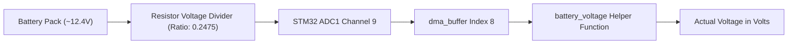

# Utility Helpers Module (`utils.c`) Documentation

This document explains every function implemented in [`core/src/utils.c`](file:///H:/Jaishnu/stm_workspace_2/line_follower/core/src/utils.c). The module provides mathematical helper functions for integer/float value clamping and battery voltage conversion calculations from 12-bit ADC DMA readings.

---

## Table of Contents
1. [Battery Voltage Scaling Formula](#battery-voltage-scaling-formula)
2. [Function Reference](#function-reference)
   - [`constrain_int`](#1-constrain_int)
   - [`constrain_float`](#2-constrain_float)
   - [`battery_voltage`](#3-battery_voltage)
3. [Cross-Module Documentation Links](#cross-module-documentation-links)

---

## Battery Voltage Scaling Formula

The line follower measures main battery supply voltage via a resistive voltage divider connected to ADC1 Channel 9.

$$\text{Voltage} = \frac{\text{ADC Reading} \times 3.3}{4095.0 \times 0.2475}$$

- **`3.3`**: STM32 analog reference voltage ($V_{\text{REF}} = 3.3\text{ V}$).
- **`4095.0`**: 12-bit ADC maximum digital resolution ($2^{12} - 1$).
- **`0.2475`**: Resistor voltage divider attenuation factor ($\frac{R_2}{R_1 + R_2}$).

---

## Function Reference

### 1. `constrain_int`

- **Signature**: `int constrain_int(int x, int min, int max)`
- **Location**: [`utils.c: L14-L19`](file:///H:/Jaishnu/stm_workspace_2/line_follower/core/src/utils.c#L14-L19)
- **Parameters**: `x` - Integer value to constrain; `min` - Lower bound; `max` - Upper bound.
- **Returns**: `int` - Clamped value within `[min, max]`.
- **Description**: Clamps input integer `x` within `[min, max]`. Used in motor speed limits and sensor scaling.

---

### 2. `constrain_float`

- **Signature**: `float constrain_float(float x, float min, float max)`
- **Location**: [`utils.c: L21-L26`](file:///H:/Jaishnu/stm_workspace_2/line_follower/core/src/utils.c#L21-L26)
- **Parameters**: `x` - Float value to constrain; `min` - Lower bound; `max` - Upper bound.
- **Returns**: `float` - Clamped value within `[min, max]`.
- **Description**: Clamps floating-point value `x` within `[min, max]`.

---

### 3. `battery_voltage`

- **Signature**: `float battery_voltage(volatile uint16_t *dma_buffer)`
- **Location**: [`utils.c: L29-L35`](file:///H:/Jaishnu/stm_workspace_2/line_follower/core/src/utils.c#L29-L35)
- **Parameters**: `dma_buffer` - Pointer to raw DMA buffer array.
- **Returns**: `float` - Actual measured battery voltage in Volts.
- **Description**: Reads raw 12-bit ADC value at `dma_buffer[NUM_SENSORS]` (index 8) and computes true battery voltage using the resistor divider equation.

---

## Cross-Module Documentation Links

- ⚡ [Motor Control & Voltage Compensation (`docs/motor.md`)](file:///H:/Jaishnu/stm_workspace_2/line_follower/docs/motor.md)
- 📡 [Main Control Loop & System Architecture (`docs/main.md`)](file:///H:/Jaishnu/stm_workspace_2/line_follower/docs/main.md)
- 📊 [Sensor Module Architecture (`docs/sensor_module.md`)](file:///H:/Jaishnu/stm_workspace_2/line_follower/docs/sensor_module.md)
- 🖥️ [Python PID Tuner Dashboard (`docs/pid_tuner.md`)](file:///H:/Jaishnu/stm_workspace_2/line_follower/docs/pid_tuner.md)
- 📑 [Documentation Index (`docs/README.md`)](file:///H:/Jaishnu/stm_workspace_2/line_follower/docs/README.md)
